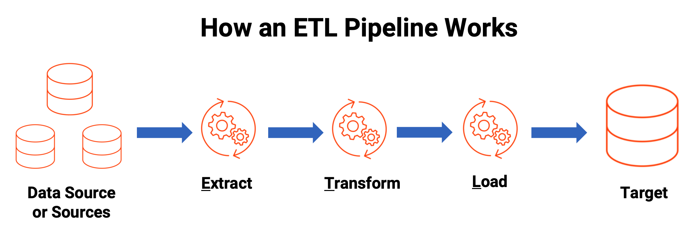

# ETL 
## Extract >>> Transform >>> Load

### Overview

This ETL (Extract, Transform, Load) project is designed to provide a robust solution for parallel data processing. It is compatible with both relational and non-relational databases, including MySQL, MongoDB, and Elasticsearch. The project is dockerized for enhanced development flexibility and can be easily managed using docker-compose. Additionally, you can schedule the execution of services using Apache Airflow.

### Features

* Dockerized: Easily deploy and manage the project using Docker containers, ensuring robustness and scalability.
* Database Compatibility: Supports a variety of databases including MySQL, MongoDB, and Elasticsearch, making it versatile for different data sources.
* Apache Airflow Integration: Schedule and automate the execution of ETL tasks with Apache Airflow for improved workflow management.
* Online Service Capabilities: The project can serve as an online service for websites, providing real-time data processing capabilities.
* Easy Testing: Utilize Fast API for quick and efficient testing of service functionality, both automated and manual.
* Python Packages and AutoML: Leverage various Python packages and integrate autoML services for advanced data transformations.
* Powerful Utilities: Includes powerful utilities such as logging with Splunk, helper functions, and configuration management for enhanced performance and monitoring.

### Getting Started

To get started with this ETL project, follow these steps:

Clone the repository to your local machine.
Install Docker and docker-compose if not already installed.
Configure your database connections in the appropriate configuration files.
Run docker-compose up to start the services.
Access the Fast API endpoints..
Optionally, integrate with Apache Airflow for scheduled tasks and workflows.

### Discussion and Feedback
I encourage discussions and feedback on my this pipline!

Feel free to share your insights, suggestions, or critiques by opening GitHub Issues. You can also reach out directly via email at aaminmola@gmail.com for more detailed discussions.
